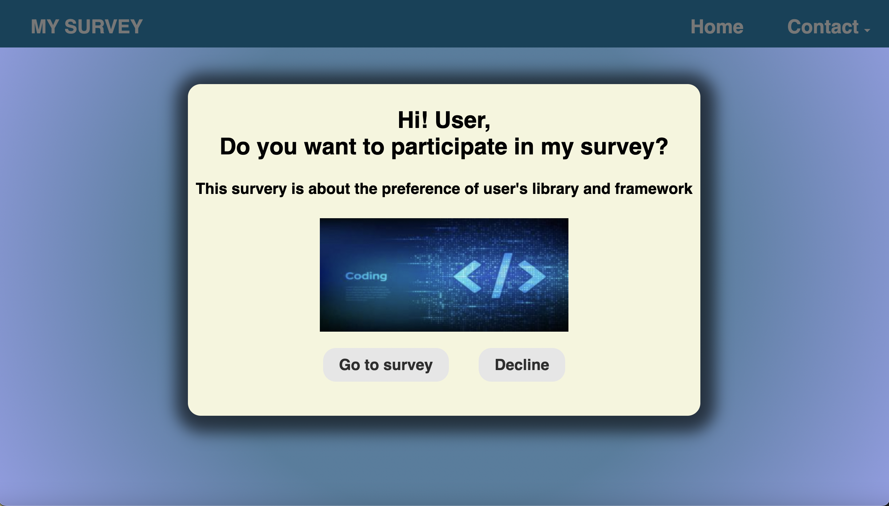
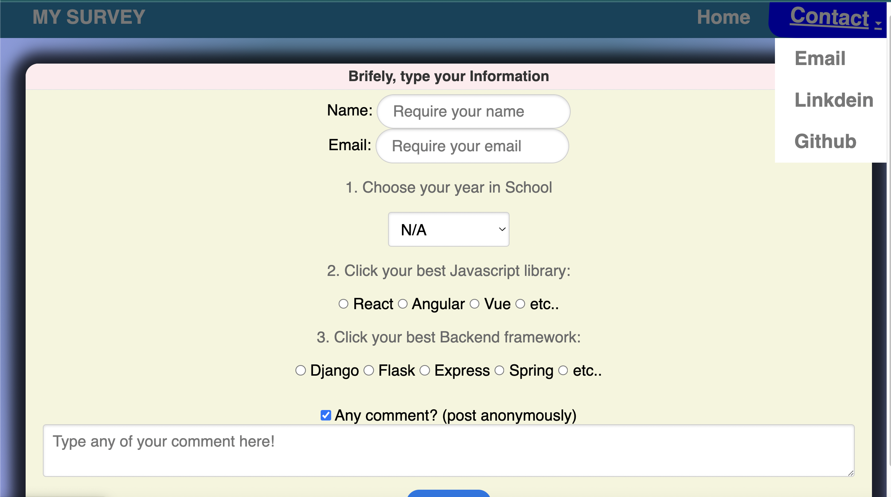
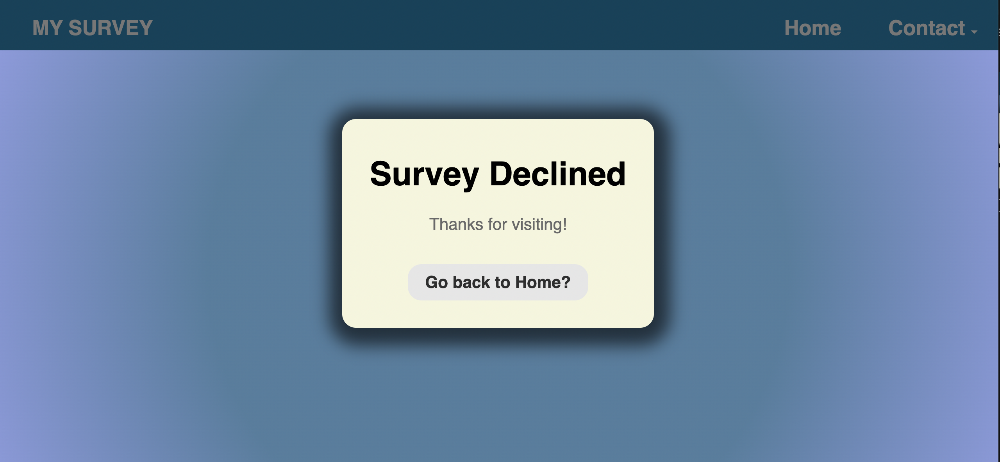
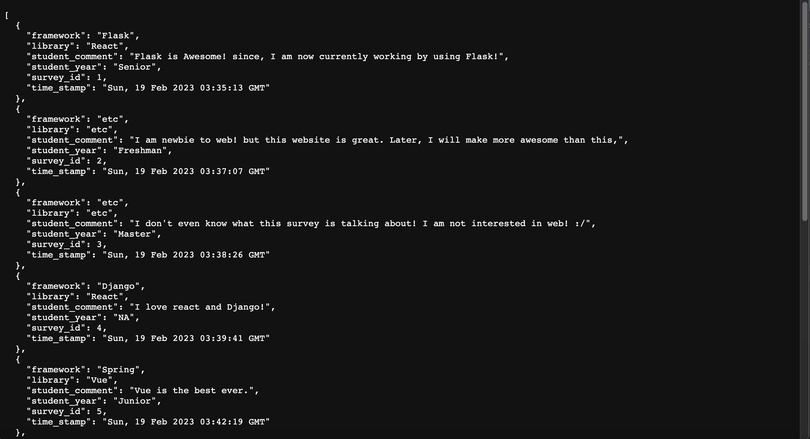
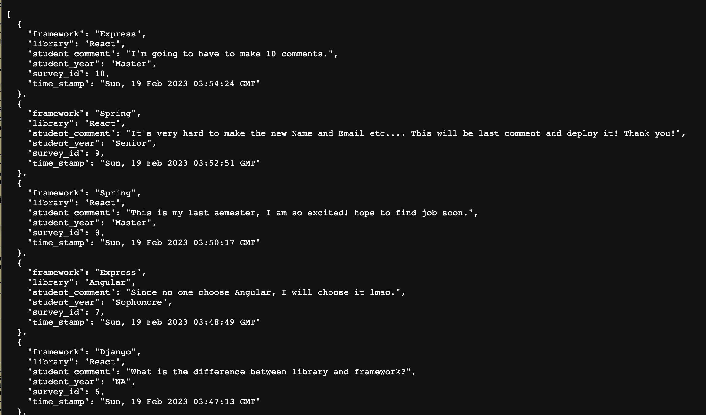
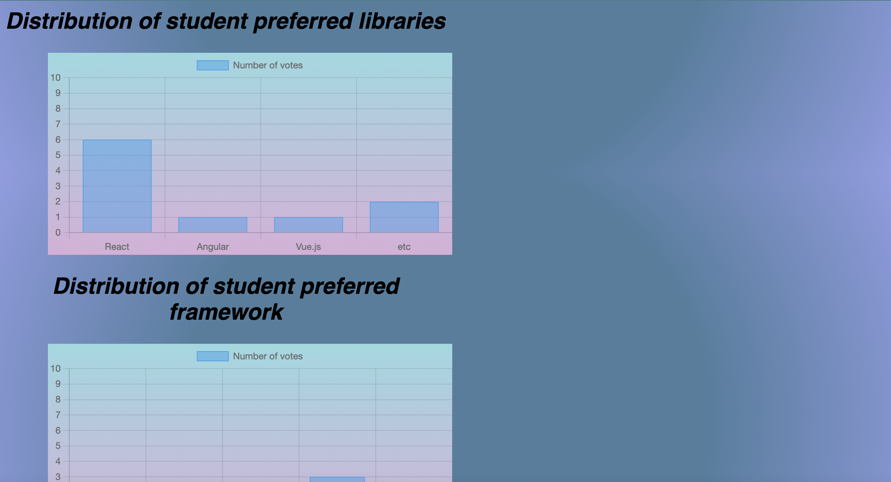
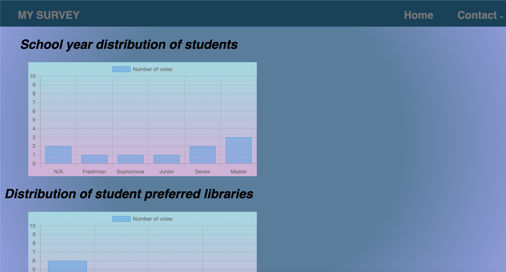
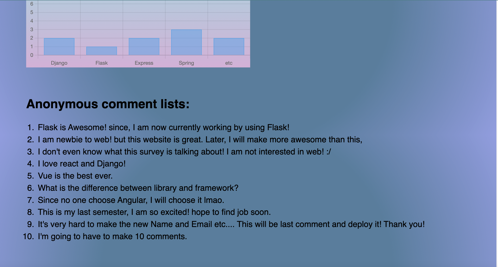

# CSCI 5117 Spring 2023 - My survey

## App Design -

Figure 1 "Index.html"

    / -> The root page descirbes the survey and asks the users to consent to participate. It has two buttons at the bottom: "consent"(go to /survey) and "decline"(go to /decline).

Figure 2 "survey.html"
    
    /survey -> Asks the user's perference of lirary,framework,school year and comment.

Figure 3 "decline.html"

    /decline -> A page that shows "thanks anyway"

Figure 4 "Api results"   

    /api/results -> This URL is an API endpoint that returns a JSON representation of all the survey responses that I have collected to date.

Figure 5 "Api results reverse"

    /api/results?=reverse= true -> if the user includes this query parameter the results are instead ordered by most recent firsta

Figure 5 "FirstChart"

Figure 6 "SecondChart"

Figure 7 "Comments"

    /admin/summary -> This web page shows an aggregated summary of the survey results.
  For making the chart, I have used  <https://www.chartjs.org/>

  ## Link to site
  <https://mysurvey.onrender.com/>

  ## See the survey results
  <https://mysurvey.onrender.com/admin/summary>
